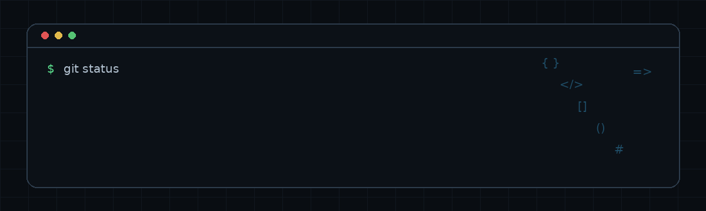

  

# 👨‍💻 Sobre mim

Olá! Eu sou **Thiago Lopes**, tenho **16 anos** e sou estudante de **Desenvolvimento de Sistemas** na **Etec Fernando Prestes**, atualmente no **2º ano**.
Tenho interesse em **programação, desenvolvimento de software e tecnologia**, buscando constantemente aprimorar meus conhecimentos por meio de projetos práticos, estudos e desafios de programação.
Além da área de tecnologia, também sou **músico-estudante da Fundec Sorocaba**, onde estudo **violino**. A música faz parte importante da minha formação e contribui para o desenvolvimento de disciplina, concentração, organização e dedicação aos estudos.

## 🎯 Objetivos
- Terminar **Ensino médio técnico AMS** e faculdade

-  Conseguir **estágio** na área no primeiro ano de faculdade
-  Aprofundar meus **conhecimentos em programação** e em tecnologia
-  Desenvolver **projetos** cada vez mais completos e profissionais
-  **Construir uma carreira** na área de desenvolvimento de software

## 🛠 Skills
Atualmente, venho desenvolvendo conhecimentos em diferentes áreas do desenvolvimento, incluindo:

* **Java** — Programação Orientada a Objetos e desenvolvimento de aplicações
* **C#** — Desenvolvimento de aplicações e projetos acadêmicos
* **HTML, CSS e JavaScript** — Desenvolvimento Web
* **PHP** — Desenvolvimento Back-end
* **MySQL / SQL** — Banco de dados e consultas
* **English** — Estou desenvolvendo cada dia
  

  
  
  
  

# 🚀 Projetos
### 📦 Sistema de Gestão de Clientes
Sistema desenvolvido para cadastro de clientes.
**Tecnologias:** PHP, HTML, CSS e JS
[🔗 Ver projeto](https://github.com/Thiagdz49/crudsimples)

* 🖥️ **Veja meu Portifólio**[Mywebsite](http://thiagdz49.github.io/)
# 📊GitHub Stats

  

  

# Contatos
   
